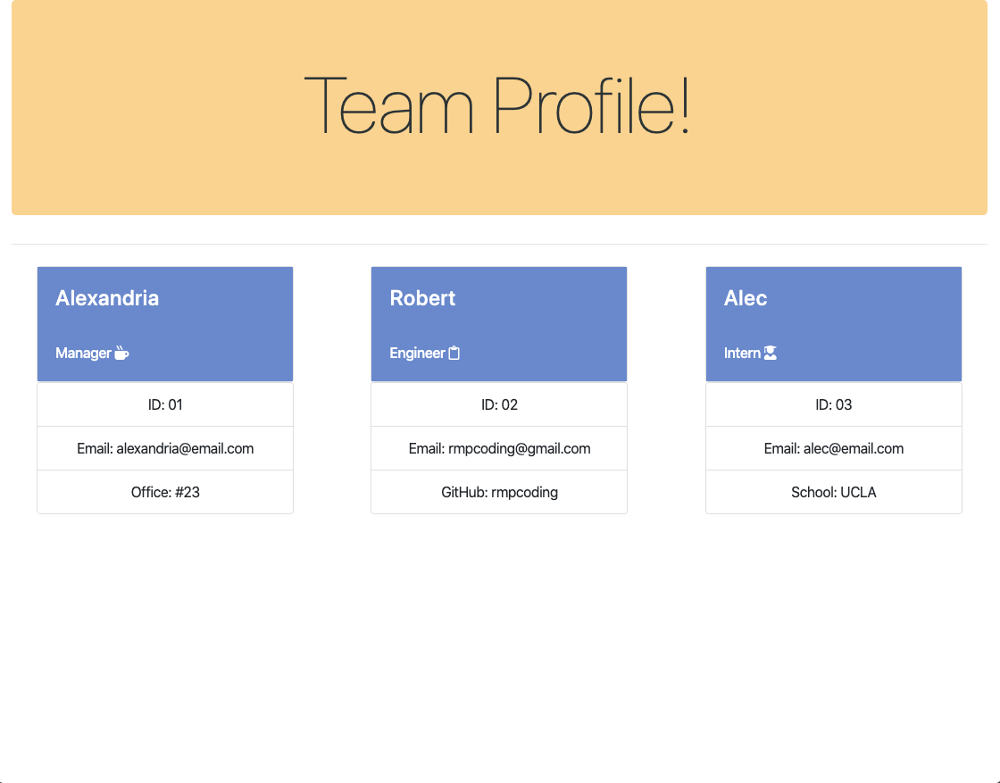
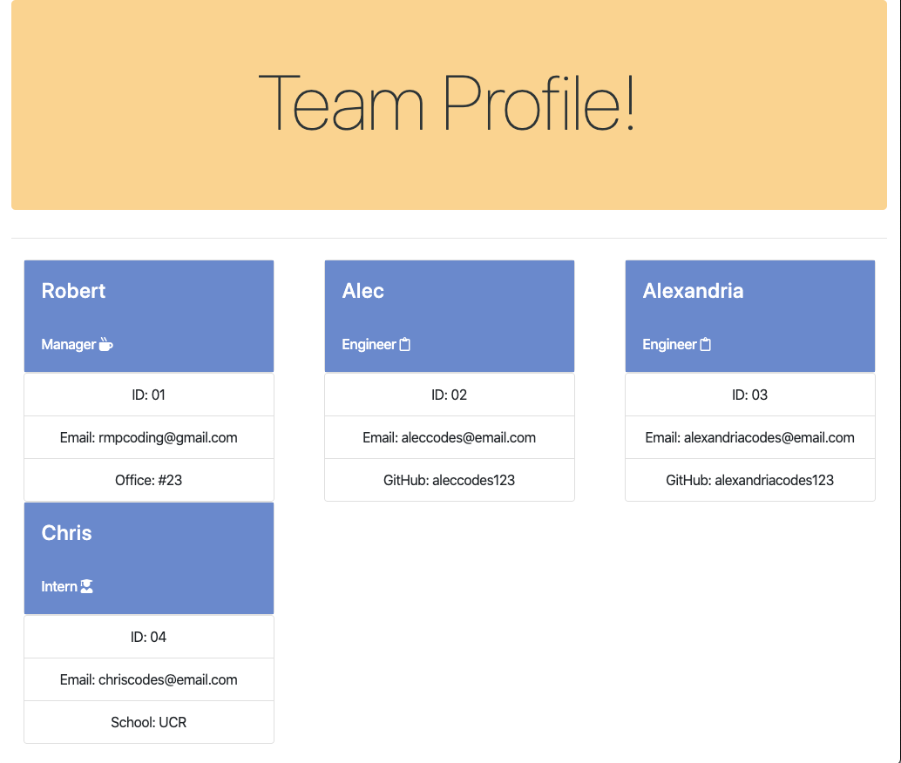

# nodejs-team-profile-cli-application

A CLI application with the ability to output a team roster in HTML, including one manager, an extensible amount of engineers, and an extensible amount of interns. 

The user is prompted to fill in the following information on employees:

* name
* id
* email
* office number (manager)
* github username (engineer)
* school (intern)

## Technologies used

* JavaScript ES6
* nodeJS
* Jest
* Inquirer
* HTML
* CSS
* Bootstrap